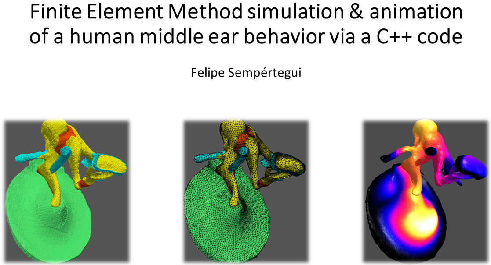

# Summary:

This project was developed by Felipe Sempértegui between March and August 2020. It was built to both simulate the dynamic behavior of a sample via the Finite-Element-Method and to visualize the generated displacement results with the OpenGL graphics API. So far, the FEM solver was developed, so it could include the following constraints and surface loads on the mesh's facets:
* fixed boundary contiditions,
* uniform excitation pressure,
* viscous damping per unit area.

The domains can also be set with internal damping loss factors. This feature and the addition of a "viscous damping surface load" generate complex-valued elements for the sparse & linear system. 

By default, the elements' matrices are computed via a Cartesian coordinate system. However, if the user wishes to include a description of a local coordinate system for a certain domain, he can also add it before the linear system is assembled & solved. Moreover, orthotropic material properties can be set for individual domains of the mesh in accordance with proposition of [1].

The user can also select several excitation frequencies after the assembly of the global matrices. Since the number of the generated displacement results are equal to the number of selected frequencies, OpenGL was set to display animations from all selected vibration patterns. During the animation, the model can also be rotated and zoomed (in & out) with the mouse and by pressing the keyboard, respectively. These animations are comprised with the deformed mesh of the model; a “thermal” color function, which changes with respect to the model's displacement; and phong reflection on the model’s external surface. Lastly, openMP was used to speed up the computation of the element’s matrices and the post-processing of the displacement results.

# Example:

In this repository, the mesh of a human middle ear (processed from one of the geometries presented by [2]) is used as an example to show the code's features. Both the computed results from this particular mesh & an overview of this work can be seen at https://youtu.be/mKMtpNN1xUQ .

All methods of the current FEM class are useful to represent several peculiarities a middle ear. They are described next:
* Orthotropic material properties of the eardrum’s radial and circumferential fibers, whose directions are taken into account by including a local coordinate system
* Distinct domains (eardrum, malleus, incus, stapes, etc) with their respective material properties
* Internal damping for all domains of the mesh and the impedance of the cochlear fluid

# This example can be subdivided into 5 main steps:

1. A middle ear mesh (GMSH) based on the works of [2] is imported together with model’s several material properties (Young’s moduli, densities & internal damping loss factor). The GMSH file contains the information regarding the mesh’s domains (i.e., eardrum, malleus, incus, etc) and a group of boundaries conditions. The latter can be divided into 3 distinct boundary types:
   * Fixed boundary conditions: located at the outer circumference of the eardrum and at the end of both tendons and ligaments
   * Uniform & harmonic excitation pressures: set at the boundaries describing the lateral region of the eardrum. It simulates the sound stimuli that reaches that membrane
   * Damping: the acoustic resistance of the cochlear fluid (which damps the stapes movement) is set at the surface of the stapes footplate.

2. All global & sparse matrices (mass, damping & stiffness) and the load vector are computed and assembled in parallel via openMP. Right after this procedure, the fixed boundary conditions are applied to the generated matrices.

3. The frequencies of the excitation pressures are typed by the user, which -  in combination with the constrained matrices – are used to solve the linear system and provide complex-valued displacement fields.

4. The facets, nodes & generated displacements of the model’s external surface are extracted & converted from the complex domain to the time domain. The goal of this step is to prepare the data to be rendered with OpenGL. The following data are generated:
   * Deformed mesh of the model as a function of time
   * Colors at the vertices as functions of the nodes’ absolute displacements. The chosen color distribution is similar to the “thermal” colormap of matplotlib
   * Vertex normals for every time-step, as it is a necessary input for the phong lightning set in our shader (“FEMsourceCodes/vertexFragmentShaders.shader”)
   
5. The data is visualized using the OpenGL API. The material is set as a combination of the data generated during the previous step (deformed mesh, colors and normals) and the vertex and fragment shaders.

# Instructions for Visual Studio 2019:

Firstly, it must be said that the code is ready to use only if it run and set in Visual Studio 2019 and the program requires the inclusion of the following external libraries:

* Matrix manipulations & sparse linear system solvers: Eigen, Intel® MKL (called from the Eigen libraries) & openMP
* Real-time rendering (dynamic draw calls & transformation matrices): GLFW, GLM & OpenGL

The mentioned dependencies must be acquired by user and enabled in Visual Studio. However, this repository also contains a “externalLibraries” folder for convenience. Among the aforementioned dependencies, the only one, which must be acquired by the user himself, is the Intel® MKL. After acquiring it via the Intel’s website (link shown below) and configuring it, a new tab is available in Visual Studio (Properties/Configuration Properties/Intel Performance Libraries).

Link: https://software.intel.com/content/www/us/en/develop/articles/intel-math-kernel-library-intel-mkl-2020-install-guide.html?wapkw=MKL

With the dependencies available in the repository and the Intel® MKL enabled in Visual Studio, the following changes should take place under “Properties/ Configuration Properties”:

### Intel Performance Libraries/Intel Math Kernel Library:
* Use Intel MKL: select “Sequential”
* Use ILP64 interfaces: select “No”
* Use MPI Library: select “Intel(R) MPI”

### C/C++:

* General/ Additional Include Directories:
   * $(SolutionDir)externalLibraries\GLM\include
   * $(SolutionDir)externalLibraries\GLFW\include
   * $(SolutionDir)externalLibraries\glew-2.1.0\include
   * $(SolutionDir)externalLibraries\eigen-3.3.7
   * $(SolutionDir)externalLibraries\libigl-master\include
   * $YOUR_PATH\IntelSWTools\compilers_and_libraries_2020.1.216\windows\mkl\include
* Language/Open MP Support: Select “Yes (/openmp)”
* Command Line: in “Additional Options” type “/Zc:twoPhase-”

### Linker

* General/Additional Library Directories:
   * $(SolutionDir)externalLibraries\glew-2.1.0\lib\Release\x64
   * $(SolutionDir)externalLibraries\GLFW\lib-vc2019
   * $YOUR_PATH\IntelSWTools\compilers_and_libraries_2020.1.216\windows\mkl\lib\intel64_win
   * $YOUR_PATH\IntelSWTools\compilers_and_libraries_2020.1.216\windows\compiler\lib\ia32_win

* Input/Additional dependencies: "mkl_intel_thread.lib; libiomp5md.lib; mkl_sequential.lib; mkl_core.lib; mkl_intel_lp64.lib; glew32.lib; glfw3.lib; opengl32.lib; User32.lib; Gdi32.lib; Shell32.lib"

Lastly, make sure the library "glew32.dll" is present in your "%SystemRoot%/system32" folder.

# References:
* [1]: Li, Y., & Barbič, J. (2014, July). Stable orthotropic materials. In Proceedings of the ACM SIGGRAPH/Eurographics Symposium on Computer Animation (pp. 41-46). Eurographics Association.
* [2]: De Greef, D., Pires, F., & Dirckx, J. J. (2017). Effects of model definitions and parameter values in finite element modeling of human middle ear mechanics. Hearing research, 344, 195-206.
